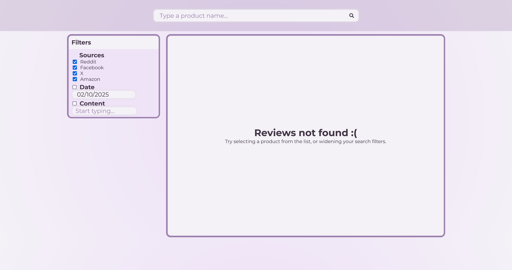
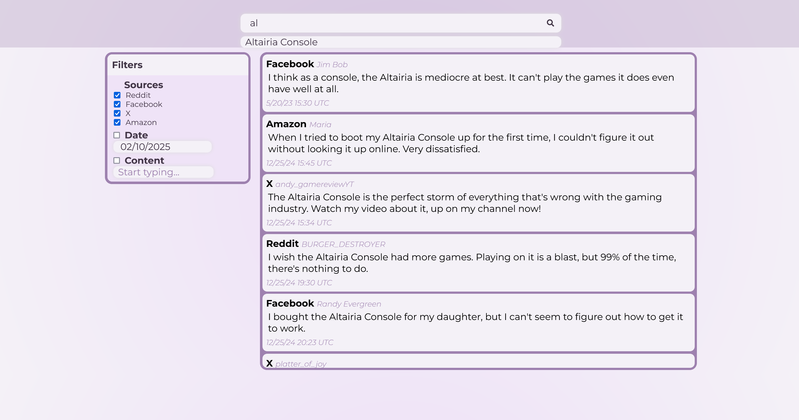

# Review Search App
*developed using React and Vite* - [Link to Figma design](https://www.figma.com/design/1N39EKyYtmZO3RUczSwL4D/Search-app?node-id=0-1&t=4HGQdAxcJRUAPgDa-1)

# Features:
- Takes data from a JSON file
- Search for different products, get the reviews for those products
- Filter results based on where the review came from, when the review was published, and what keywords the review contains
- Dynamic list, as long as the objects are in the same format as the ones in `data.json` adding new sources, reviews, etc. will update the displayed results accordingly

# Dependencies
- [React Datepicker](https://github.com/Hacker0x01/react-datepicker), *used for the calendar date picker for the date filter*

# Screenshots

